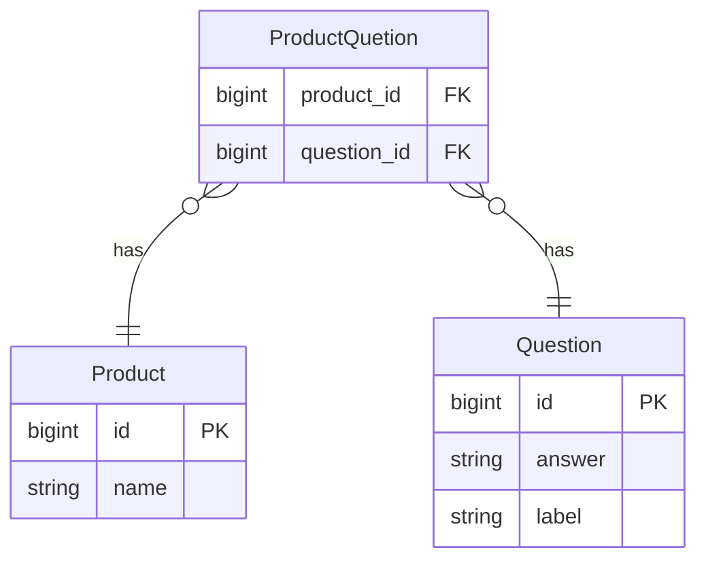

# Backend-Pair-Programming-Interview

## Dependencies

| Name  | Version |
|-------|---------|
| Ruby  | 2.7.6   |
| Rails | 7.0.4   |

## Setup

Clone this project locally. In your terminal, `cd` to the root of the project and run:

    bin/setup

## Database Seeds

Seed data can be found in the `db/seeds.rb` file. Initially seed the database with:

    bin/rails db:seed

If you change the seed file and wish to seed the database from scratch, run:

    bin/rails db:seed:replant

## Tests

In the project root directory run:

    bin/rspec

## Data Model Diagram

