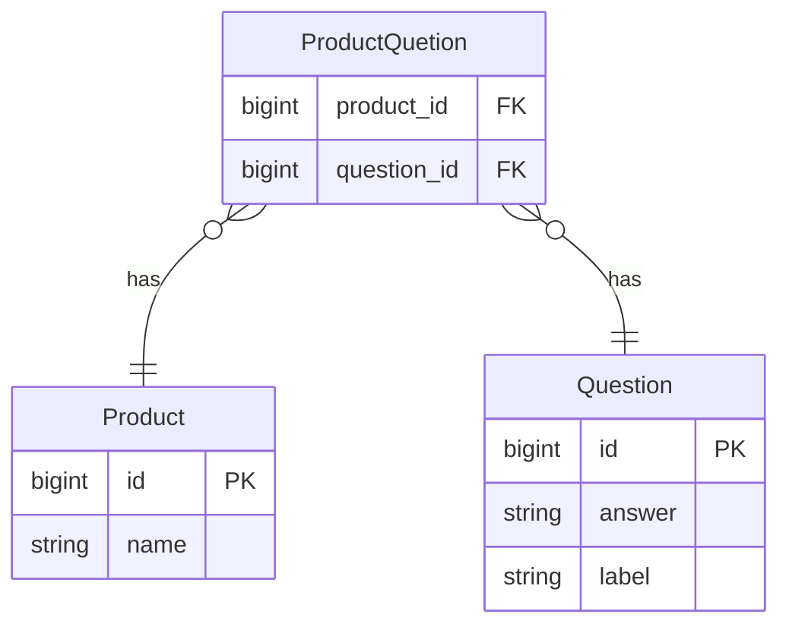

# Backend-Pair-Programming-Interview

The repo is the beginning of a FAQ feature for an ecommerce site. It ties FAQ questions to products, such that product
pages can display these questions and answers below the product info.

## Dependencies

| Name       | Version |
|------------|---------|
| Ruby       | 2.7.6   |
| Rails      | 7.0.4   |
| PostgreSQL | 14.5    |

## Setup

Clone this project locally. In your terminal, `cd` to the root of the project and run:

    bin/setup

## Database Seeds

Seed data can be found in the `db/seeds.rb` file. Initially seed the database with:

    bin/rails db:seed

If you change the seed file and wish to seed the database from scratch, run:

    bin/rails db:seed:replant

## Tests

In the project root directory run:

    bin/rspec

## Endpoints

| HTTP Method | Endpoint   | Description           |
|-------------|------------|-----------------------|
| GET         | /questions | List of all questions |
| POST        | /questions | Add a new question    |

## Data Model Diagram

| Model           | Description                                                |
|-----------------|------------------------------------------------------------|
| Product         | An item that can be sold on the website                    |
| ProductQuestion | Join table for Products and Questions                      |
| Question        | A general question or a question associated with a product |